```{r setup, include=F}
knitr::opts_chunk$set(echo = F, message = F, warning = F)

# libraries
library(flexdashboard)
library(mapview)
library(leaflet)
library(tbeptools)
library(tidyverse)
library(shiny)
library(sf)
library(RColorBrewer)
library(extrafont)
library(plotly)
library(lubridate)
library(shinyWidgets)

# # style file
# styles <- readLines('https://raw.githubusercontent.com/tbep-tech/css-styling/master/styles.css')
# writeLines(styles, 'styles.css')

loadfonts(device = 'pdf', quiet = T)
if(Sys.info()[1] == 'Windows')
  loadfonts(device = 'win', quiet = T)

source('R/funcs.R')

load('data/epcdata.RData')
load('data/algdat.RData')
load('data/avedat.RData')
load('data/mapdat.RData')
load('data/plotlys.RData') # thrplototb, thrplothb, thrplotmtb, thrplotltb, attmat, chlmat, lamat

prj <- '+proj=longlat +ellps=WGS84 +datum=WGS84 +no_defs'
maxyr <- 2020
fml <- "Lato Light"

# minor theme tweaks
pthm <- theme(
    axis.text.x = element_text(size = 11, angle = 45, hjust = 1),
    legend.text = element_text(size = 12), 
    axis.title.y = element_text(size = 12),
    text = element_text(fml), 
    legend.position = 'top',
    # panel.grid.minor=element_blank(),
    # panel.grid.major=element_blank(),
    panel.background = element_rect(fill = '#ECECEC')
    ) 

# locations
locs <- epcdata %>% 
  select(epchc_station, Longitude, Latitude) %>% 
  unique %>% 
  st_as_sf(coords = c('Longitude', 'Latitude'), crs = prj)

# algae names and colors
algnms <- c('Bacillariophyta', 'Cyanobacteria', 'Karenia brevis', 'Pseudo-nitzschia pungens', 'Pseudo-nitzschia sp.', 'Pyrodinium bahamense', 'Tripos hircus', 'other')
cols <- pal_alg(algnms)
names(cols) <- algnms

downloadButtonRmd <- function (outputId, label = "Download", class = NULL, ...)  {
  tags$a(id = outputId, class = paste("btn btn-default shiny-download-link", 
                                      class), href = "", target = "_blank", download = NA, 
         icon("download"), label, ...)
}
```

```{r reactives, context = 'server'}
# OTB boxplot
boxplototb <- reactive({

  # inputs
  yrsselseas <- input$yrsselseas
  yrselseas <- input$yrselseas
  
  out <- boxplotly(epcdata, 'OTB', yrselseas, yrsselseas, fml, pthm)

  return(out)

})

# OTB boxplot click
otbclkrct <- reactive({
  
  selin <- event_data("plotly_click", source = 'otbclk', priority = 'event')
  
  boxplototb <- boxplototb()

  validate(
    need(!is.null(selin), 'Click point from plot to view algae counts')
  )

  out <- try({selfun(selin, boxplototb, algdat, epcdata, 'OTB')}, silent = TRUE)

  validate(
    need(nrow(out) > 0, 'No phytoplankton data')
  )
  
  return(out)
  
})

# OTB algae selection
otbalg <- reactive({
  
  otbclkrct <- otbclkrct()
  
  out <- algselplo(otbclkrct, algnms, cols, fml)

  return(out)
  
})

# HB boxplot
boxplothb <- reactive({
  
  # inputs
  yrsselseas <- input$yrsselseas
  yrselseas <- input$yrselseas
  
  out <- boxplotly(epcdata, 'HB', yrselseas, yrsselseas, fml, pthm)

  return(out)
  
})

# HB boxplot click
hbclkrct <- reactive({
  
  selin <- event_data("plotly_click", source = 'hbclk')
  boxplothb <- boxplothb()
  
  validate(
    need(!is.null(selin), 'Click point from plot to view algae counts')
  )

  out <- selfun(selin, boxplothb, algdat, epcdata, 'HB')
  
  validate(
    need(nrow(out) > 0, 'No phytoplankton data')
  )
  
  return(out)
  
})

# HB algae selection
hbalg <- reactive({
  
  hbclkrct <- hbclkrct()
  
  out <- algselplo(hbclkrct, algnms, cols, fml)
  
  return(out)
  
})

# MTB boxplot
boxplotmtb <- reactive({
  
  # inputs
  yrsselseas <- input$yrsselseas
  yrselseas <- input$yrselseas
  
  out <- boxplotly(epcdata, 'MTB', yrselseas, yrsselseas, fml, pthm)
  
  return(out)
  
})

# MTB boxplot click
mtbclkrct <- reactive({
  
  selin <- event_data("plotly_click", source = 'mtbclk')
  boxplotmtb <- boxplotmtb()
  
  validate(
    need(!is.null(selin), 'Click point from plot to view algae counts')
  )
  
  out <- selfun(selin, boxplotmtb, algdat, epcdata, 'MTB')
  
  validate(
    need(nrow(out) > 0, 'No phytoplankton data')
  )
  
  return(out)
  
})

# MTB algae selection
mtbalg <- reactive({
  
  mtbclkrct <- mtbclkrct()
  
  out <- algselplo(mtbclkrct, algnms, cols, fml)
  
  return(out)
  
})

# LTB boxplot
boxplotltb <- reactive({
  
  # inputs
  yrsselseas <- input$yrsselseas
  yrselseas <- input$yrselseas
  
  out <- boxplotly(epcdata, 'LTB', yrselseas, yrsselseas, fml, pthm)

  return(out)
  
})

# LTB boxplot click
ltbclkrct <- reactive({
  
  selin <- event_data("plotly_click", source = 'ltbclk')
  boxplotltb <- boxplotltb()
  
  validate(
    need(!is.null(selin), 'Click point from plot to view algae counts')
  )
    
  out <- selfun(selin, boxplotltb, algdat, epcdata, 'LTB')
  
  validate(
    need(nrow(out) > 0, 'No phytoplankton data')
  )
  
  return(out)
  
})

# LTB algae selection
ltbalg <- reactive({
  
  ltbclkrct <- ltbclkrct()
  
  out <- algselplo(ltbclkrct, algnms, cols, fml)
  
  return(out)
  
})

# map data 
maprct <- reactive({
  
  # input
  mapref <- input$mapref
  
  if(mapref == 'threshold')
    out <- mapdat %>% 
      mutate(
        met = ifelse(val < thresh, 'yes', 'no')
      )
  
  if(mapref == 'target')
    out <- mapdat %>% 
      mutate(
        met = ifelse(val < target, 'yes', 'no')
      )
  
  return(out)
  
})

# domain for map color points
mapdmn <- reactive({
  
  # input
  maprct <- maprct()
  
  out <- maprct %>% 
    group_by(thr, met) %>% 
    nest %>% 
    mutate(
      rng = purrr::map(data, function(x) range(x$val, na.rm = T))
    ) %>% 
    select(-data) %>% 
    unnest(rng)
  
  return(out)
  
})

# color palette for target met
palyes <- reactive({
  
  # inputs
  thrsel <- input$thrsel
  mapdmn <- mapdmn()
  
  dmn <- mapdmn %>% 
    filter(thr == thrsel) %>% 
    filter(met == 'yes') %>% 
    pull(rng)
  
  colorNumeric(
    palette = brewer.pal(4, 'Greens'),
    na.color = 'yellow',
    domain = dmn
    )
  
})

# color palette for target not met
palno <- reactive({
  
  # inputs
  thrsel <- input$thrsel
  mapdmn <- mapdmn()
  
  dmn <- mapdmn %>% 
    filter(thr == thrsel) %>% 
    filter(met == 'no') %>% 
    pull(rng)
  
  colorNumeric(
    palette = brewer.pal(4, 'Reds'),
    na.color = 'yellow',
    domain = dmn
    )
  
})
  
# site attainment map
attmap <- reactive({
  
  # inputs
  thrsel <- input$thrsel
  yrsel <- input$yrsel
  mapref <- input$mapref
  palyes <- palyes()
  palno <- palno()
  maprct <- maprct()
  mapdmn <- mapdmn()
  
  # filter by year to map
  toplo <- maprct %>% 
    filter(thr %in% thrsel) %>% 
    select(-thr) %>% 
    filter(yr %in% yrsel) %>% 
    mutate(
      cols = case_when(
        met == 'yes' ~ palyes(val),
        met == 'no' ~ palno(val)
      ), 
      ptlab = case_when(
        mapref == 'threshold' ~ thresh, 
        mapref == 'target' ~ target
      )
    ) %>% 
    left_join(locs, ., by = 'epchc_station') 

  # polygon attainment data for selected year
  attyr <- avedat %>% 
    filter(yr %in% yrsel) %>% 
    left_join(tbseg, ., by = 'bay_segment')
  
  # values to feed to legend  
  yesval <- mapdmn %>% filter(thr == thrsel) %>% filter(met == 'yes') %>% pull(rng)
  noval <- mapdmn %>% filter(thr == thrsel) %>% filter(met == 'no') %>% pull(rng)
  
  # for point scaling, original range
  scls <- dplyr::case_when(
    thrsel == 'chla' ~ c(0.59, 58), 
    thrsel == 'la' ~ c(0.38, 5.92)
  )
  
  # map with custom legends
  mapview(toplo, fill = F, homebutton = F, popup = NULL, legend = F) %>% 
    .@map %>% 
    leafem::removeMouseCoordinates() %>% 
    clearMarkers() %>% 
    addPolygons(
      data = attyr, 
      stroke = T, 
      color = 'grey', 
      weight = 1, 
      layerId = ~long_name, 
      fillColor = ~outcome, 
      fillOpacit = 0.5,
      label = ~paste0(bay_segment, ': ', long_name, ', Action: ', action, ' (', outcome, ')')
    ) %>% 
    addCircleMarkers(
      data = toplo, 
      layerId = ~epchc_station,
      stroke = TRUE,
      color = 'black',
      fill = TRUE,
      fillColor = ~cols,
      weight = 1,
      fillOpacity = 1,
      radius=~scales::rescale(val, from = scls, to = c(5, 20)),
      label = ~paste0('Station ', epchc_station, ' (', mapref, ' met: ', met, ', value ', round(val, 2), ', ', mapref, ' ', ptlab, ')')
    ) %>% 
    addLegend("topright", labels = c("Stay the Course", "Caution", "On Alert"), colors = c("lightgreen", "yellow", "red"), title = "Bay segment decision<br>matrix outcomes", opacity = 1) %>% 
    addLegend("bottomright", pal = palno, title = paste0("Station ", mapref, "<br>not met"), labels = thrsel, opacity = 1, values = noval) %>% 
    addLegend("bottomright", pal = palyes, title = paste0("Station ", mapref, "<br>met"), labels = thrsel, opacity = 1, values = yesval)
  
})

# selected site plots
selplo <- reactive({
  
  selsit <- input$map_marker_click$id
  
  validate(
    need(!is.null(selsit), "Select station on map")
  )
  
  # data to plot
  toplo <- epcdata %>% 
    filter(epchc_station %in% selsit) %>% 
    filter(yr >= 1975) %>% 
    select(Date = SampleTime, sd_raw_m, sd_q, chla) %>% 
    mutate(Date = as.Date(Date))
  
  algplo <- algdat %>% 
    filter(epchc_station %in% selsit) %>% 
    group_by(yrqrt, name) %>%
    summarise(count = sum(count, na.rm = T)) %>% 
    ungroup %>% 
    mutate(
      name = factor(name, levels = algnms, labels = algnms)
      )

  # chl plot
  p1 <- ggplot(toplo, aes(x = Date, y = chla)) + 
    geom_line(aes(colour = 'Chlorophyll-a')) + 
    scale_colour_manual(values = "#427355") + 
    # geom_point(colour = "#427355", size = 0.5) +
    # scale_y_log10() + 
    labs(
      y = 'Concentration (ug/L)', 
      x = NULL
      ) +
    pthm + 
    theme(
      legend.title = element_blank()
    )
  
  # secchi plot
  p2 <- ggplot() + 
    geom_line(data = toplo, aes(x = Date, y = sd_raw_m, colour = 'Secchi depth')) + 
    labs(
      y = 'Depth (m)', 
      x = NULL, 
      title = paste0('Station ', selsit)
      ) + 
    scale_colour_manual(values = "#0047FE") +
    pthm +
    theme(
      legend.title = element_blank()
    )
  
  if(any(!toplo$sd_q))
    p2 <- p2 +
      geom_point(data = toplo[!toplo$sd_q, ], aes(x = Date, y = sd_raw_m, colour = 'Secchi on bottom'), size = 1.5) +
      scale_colour_manual(values = c('#0047FE', 'tomato1'))

  p1 <- ggplotly(p1, dynamicTicks = T)
  p2 <- ggplotly(p2, dynamicTicks = T)
  p3 <-  plot_ly(algplo, x = ~ yrqrt, y= ~count, color = ~name, text = ~paste0(name, ', ', yrqrt), hoverinfo = 'text') %>% 
    add_bars() %>% 
    layout(
      yaxis = list(title = 'Phytoplankton cell count (0.1/ml)', gridcolor = '#FFFFFF'),
      barmode = 'stack',
      showlegend = T, 
      font = list(family = fml), 
      plot_bgcolor = '#ECECEC'
    )
  
  out <- subplot(p3, p1, p2, nrows = 3, shareX = T, titleY = T, which_layout = 1) %>% 
    rangeslider(thickness = 0.02) %>%
    layout(
      title = paste('Station', selsit),
      legend = list(font = list(size = 16)), 
      font = list(family = fml),
      xaxis = list(
        domain = c(0.02, 1),
        rangeselector = list(
          buttons = list(
            list(step = "all"),
            list(
              count = 20,
              label = "20 yr",
              step = "year",
              stepmode = "backward"),
            list(
              count = 10,
              label = "10 yr",
              step = "year",
              stepmode = "backward"),
            list(
              count = 5,
              label = "5 yr",
              step = "year",
              stepmode = "backward"),
            list(
              count = 1,
              label = "1 yr",
              step = "year",
              stepmode = "backward")
          )
        )
      )
    )
  
  return(out)
  
})
```

```{r map, context = 'server'}
bsmap <- mapview(locs, homebutton = F, legend = F) %>% 
  .@map %>% 
  leafem::removeMouseCoordinates() %>% 
  clearMarkers() %>%
  addCircleMarkers(
    data = locs,
    layerId = ~epchc_station,
    color = '#00806E',
    stroke = F,
    fillOpacity = 0.9,
    radius = 15,
    label = ~epchc_station,
    labelOptions = labelOptions(
      textOnly = T,
      noHide = T,
      style = list(
        "color" = "#FFFFFF",
        "font-family" = fml
        ),
      direction = 'center'
    )
  )

# leaflet proxy for marker select
map <- leafletProxy('map')

observeEvent(input$map_marker_click, {
  
  selsit <- input$map_marker_click$id

  # get station selection
  selsitplo <- locs %>% 
    filter(epchc_station %in% selsit)

  # clear markers on input select, add all points and selected point
  map <- map %>% 
    removeMarker('selsit') %>% 
    addCircleMarkers(
      data = selsitplo,
      layerId = 'selsit',
      stroke = T,
      color = '#5C4A42',
      fill = F,
      radius = 16, 
      opacity = 1
    )
  
})
```

```{r downloadhandlers, context = 'server'}
# wq data
output$wqdwntab <- downloadHandler(
  filename = function(){'wqdat.csv'},
  content = function(file){
    
    # inputs
    seldl <- input$seldl
    
    todl <- epcdata %>% 
      filter(epchc_station %in% as.numeric(seldl)) %>% 
      select(bay_segment, epchc_station, SampleTime, yr, mo, Latitude, Longitude, secchi_m = sd_raw_m, secchi_q = sd_q, chla, chla_q)
    
    write.csv(todl, file, quote = T, row.names = F)
    
  }
)

# algae data
output$algdwntab <- downloadHandler(
  filename = function(){'algdat.csv'},
  content = function(file){
    
    # inputs
    seldl <- input$seldl
    
    todl <- algdat %>%
      filter(epchc_station %in% as.numeric(seldl))
    
    write.csv(todl, file, quote = T, row.names = F)
    
  }
)
```

OVERVIEW
===========================================================

Column {.tabset .tabset-fade data-width=650}
-----------------------------------------------------------------------

### USING THE DASHBOARD

<div class = "row">
<div class = "col-md-2"></div>
<div class = "col-md-8">

#### WELCOME TO THE TAMPA BAY WATER QUALITY REPORT CARD!

```{r out.width='100%', fig.align='center'}
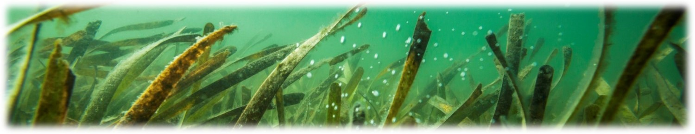
```

This dashboard synthesizes over forty years of water quality data from Tampa Bay, Florida.  The data have been collected monthly, with the only exception being March and April 2020. Information from this dashboard informs the management of environmental resources for the region under direction of the Tampa Bay Estuary Program. The different pages under the __PAGE SELECTION__ menu can be used to view the long-term trends in water quality for each bay segment and individual monitoring stations.  

1) __ATTAINMENT MATRICES__: This page shows the overall report card for the bay as management action categories described in the methods tab.  Separate matrices for chlorophyll and light attenuation exceedances for major bay segments are also shown. An interactive map is provided that shows attainment outcomes by year for individual stations in the bay.
1) __SEGMENT ANNUAL TRENDS__: This page shows time series of annual chlorophyll and light attenuation averages for each bay segment.  Blue lines on each plot show management targets or thresholds that define exceedance categories used to create the management action categories.  In between the chlorophyll and light attenuation plots is the attainment matrix outcomes that are specific to each segment. 
1) __SEGMENT SEASONAL TRENDS__: This page shows the seasonal distributions by bay segment for chlorophyll and light attenuation.  Each boxplot shows the monthly distribution of observations across all available years in the dataset.  The jittered points overlaid on the boxplots show the individual values for a specific year and the large red point shows the current year.  Each observation can be clicked to view the observed phytoplankton cell counts for the selected year/month.bay segment combination. 
1) __SITE TRENDS__: This page shows the time series for chlorophyll and light attenuation at individual stations (as compared to segment averages in the other pages).  Stations can be selected by clicking on the location in the map.  Phytoplankton cell counts can also be viewed as quarterly sums (every three months) across the period of record.  

The plots in this dashboard are interactive and display options can be controlled using a mouse. Most plots include a [control menu](https://help.plot.ly/zoom-pan-hover-controls/) on the top with different options for viewing the data.  For example, click the camera icon to download a png file for a plot.

<br>
```{r, fig.align='center', out.width='30%'}

```
<br>

#### Website information

Questions and comments about the dashboard can be sent to [Marcus Beck](mailto:mbeck@tbep.org). The website source content can be viewed on [Github](https://github.com/tbep-tech/wq-dash).  All data were obtained from the Hillsborough County Environmental Protection Commission (accessible [here](http://www.epchc.org/i-want-to/view-gis-maps-and-data)). Like this app? Share it on social media using the [\#TampaBayOpenSci](https://twitter.com/hashtag/TampaBayOpenSci?src=hashtag_click) hashtag.  

Citation info here: [](https://zenodo.org/badge/latestdoi/223773148)

<a rel='license' href='http://creativecommons.org/licenses/by/4.0/'></a>&nbsp;&nbsp;This website is licensed under a <a rel='license' href='http://creativecommons.org/licenses/by/4.0/'>Creative Commons Attribution 4.0 International License</a>.

</div>
<div class = "col-md-2"></div>
</div>

###  METHODS

<div class = "row">
<div class = "col-md-2"></div>
<div class = "col-md-8">

#### Decision support approach

Light availability to seagrass is the guiding paradigm for the Tampa Bay Estuary Program's ([TBEP](https://www.tbep.org)) Nitrogen Management Strategy. Because excessive nitrogen loads to the bay generally lead to increased algae blooms (higher chlorophyll-a levels) and reduce light penetration to seagrass, an evaluation method was developed to assess whether load reduction strategies are achieving desired water quality results (i.e. reduced chlorophyll-a concentrations and increased water clarity).

```{r out.width='50%', fig.align='center', fig.cap='The guiding paradigm for seagrass restoration through nitrogen management.'}
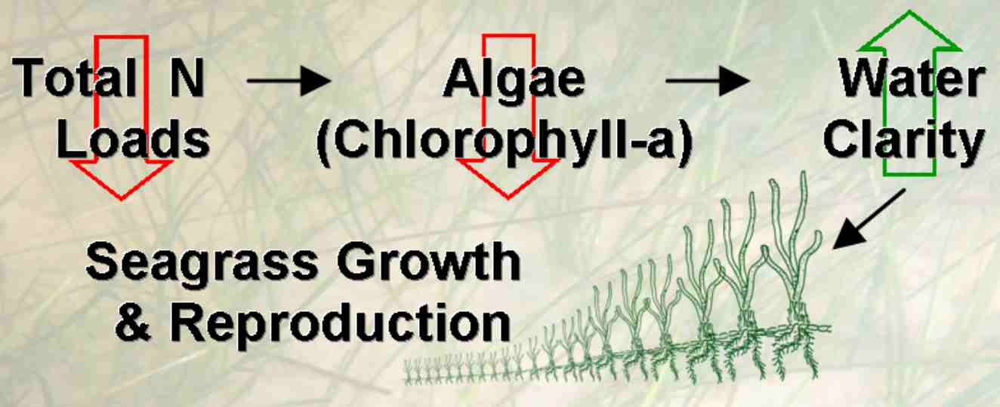
```

The attainment outcomes shown in the various dashboard pages are built on a rigorous technical foundation.  Year to year algae abundance (measured as chlorophyll-a concentrations) and visible light penetration through the water column (secchi disk depth visibility) have been identified as critical water quality indicators in Tampa Bay. Tracking the attainment of bay segment specific targets for these indicators provides the framework for developing and initiating bay management actions. TBEP management actions adopted in response to the annually-assessed decision support results are shown below.

<span style="color:#33FF3B; text-shadow: 0 0 3px #333;">__Stay the Course__</span>: Continue planned projects. Report data via annual progress reports and Baywide Environmental Monitoring Report. 

<span style="color:#F9FF33; text-shadow: 0 0 3px #333;">__Caution__</span>: Review monitoring data and nitrogen loading estimates. Begin/continue TAC and Management Board development of specific management recommendations.

<span style="color:#FF3333; text-shadow: 0 0 3px #333;">__On Alert__</span>: Finalize development and implement appropriate management actions to get back on track.

The management category or action is based on the combination of annual outcomes for chlorophyll and light attenuation.  For each year, major bay segments are assigned to outcome categories based on both the exceedance of the annual estimate above a threshold or target and duration of the exceedance for the years prior.  Exceedances are defined as either small or large based on the magnitude and short or long based on the duration within the previous four years.  The combination of these exceedance categories creates an outcome integer that each bay segment is assigned for both chlorophyll and light attenuation. 

```{r out.width='50%', fig.align='center', fig.cap='Outcomes for annual estimates of water quality are assigned an integer value from zero to three depending on both magnitude and duration of the exceedence.'}
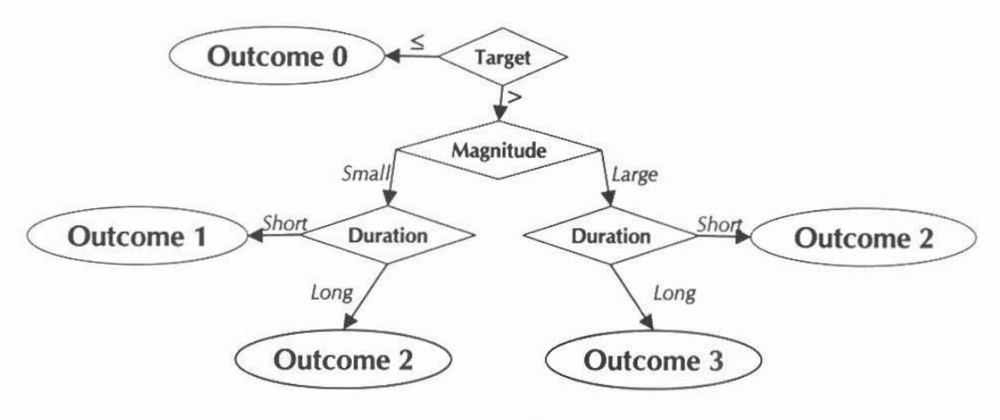
```

The chlorophyll and light attenuation outcome integers are then combined to create the management category for each bay segment.

```{r out.width='40%', fig.align='center', fig.cap='Management action categories assigned to each bay segment and year based on chlorophyll and light attenuation outcomes.'}
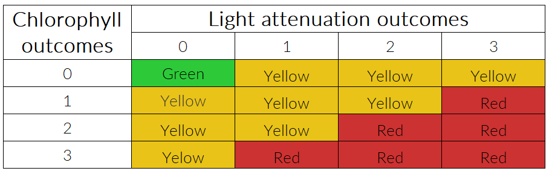
```

</div>
<div class = "col-md-2"></div>
</div>

### DOWNLOAD DATA

<div class = "row">
<div class = "col-md-2"></div>
<div class = "col-md-8">

Click the buttons below to download water quality and phytoplankton cell count data. Select all data or specific stations.  Please note that these data have been modified from the raw data provided by EPC (link below) for the purposes of this application.  View the separate pages for an explanation of the data.  

```{r}
column(12, 
       column(4, "Select stations to download:"),
       column(4, "Water quality data:"), 
       column(4, "Phytoplankton data:")
)
column(12, 
       column(4, 
              pickerInput('seldl', NULL, choices = unique(locs$epchc_station), 
                          selected = unique(locs$epchc_station), multiple = T,
                          options = list(`actions-box` = TRUE, size = 20), width = '100%')
              ),
       column(4, downloadButtonRmd('wqdwntab', 'Download')), 
       column(4, downloadButtonRmd('algdwntab', 'Download'))
)
```

</div>
<div class = "col-md-2"></div>
</div>

1 ATTAINMENT MATRICES {data-navmenu="PAGE SELECTION"}
===========================================================

Column {.tabset .tabset-fade data-width=275}
-----------------------------------------------------------------------

### Using this page

This page shows the overall report card for the bay as management action categories:

<span style="color:#33FF3B; text-shadow: 0 0 3px #333;">__Stay the Course__</span>: Continue planned projects. Report data via annual progress reports and Baywide Environmental Monitoring Report. 

<span style="color:#F9FF33; text-shadow: 0 0 3px #333;">__Caution__</span>: Review monitoring data and nitrogen loading estimates. Begin/continue TAC and Management Board development of specific management recommendations.

<span style="color:#FF3333; text-shadow: 0 0 3px #333;">__On Alert__</span>: Finalize development and implement appropriate management actions to get back on track.

Each bay segment (__OTB__: Old Tampa Bay, __HB__: Hillsborough Bay, __MTB__: Middle Tampa Bay, __LTB__: Lower Tampa Bay) is assigned to one of the three above categories for each year of data from 1975 to the current year.  The results can be viewed in the *DECISION MATRIX* tab. Hovering the mouse pointer over each cell shows details about the data driving the attainment outcome for a given year: 

<br>
```{r, out.width='70%', fig.align='center'}
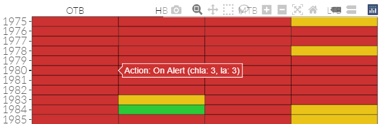
```
<br>

In the above example, the attainment outcome for Old Tampa Bay in 1980 was <span style="color:#FF3333; text-shadow: 0 0 3px #333;">On Alert</span>.  Additional information on chlorophyll and light attenuation outcomes that drive the overall attainment outcome are also provided.  Old Tampa Bay received an outcome of "3" for both chlorophyll and light attenuation results in 1980.  Possible integer values range from 0 to 3, with three indicating water quality conditions less suitable for seagrass growth.  The integer values describe both a magnitude and duration of exceedance for chlorophyll or light attenuation targets: 

<br>
```{r out.width='70%', fig.align='center'}

```
<br>

For each year and bay segment, the final outcome is based on the combination of chlorophyll and light attenuation outcomes: 

<br>
```{r out.width='70%', fig.align='center'}

```
<br>

Additional tabs show the chlorophyll and light attenuation exceedance outcomes for each year and bay segment (*CHLOROPHYLL RESULTS*, *LIGHT ATTENUATION RESULTS*).  For example, hovering a mouse over the chlorophyll matrix will show the average concentration for the segment and year, whether the value exceeded a "large" magnitude value, and the corresponding value defining the exceedance.  In this example, Old Tampa Bay in 1980 had an average chlorophyll concentration of 13.9 ug/L, which was above the threshold of 9.3 for the bay segment. 

<br>
```{r, out.width='70%', fig.align='center'}
knitr::include_graphics('www/chlattainex.PNG')
```
<br>

A similar matrix is provided for light attenuation. It is important to note that in both the chlorophyll and light attenuation matrices, the reference values represent a large exceedance value defined as twice the standard error of the historic average for years when water quality conditions were favorable for seagrass growth. 

Finally, an interactive map is provided on the right to demonstrate which stations were above or below water quality targets or thresholds defined for each bay segment.  The points are color-coded to show if the target or threshold was met and sized by the relative concentration or attenuation values observed in the selected year.  Hovering the mouse pointer over each station will show the following: 

<br>
```{r, out.width='85%', fig.align='center'}
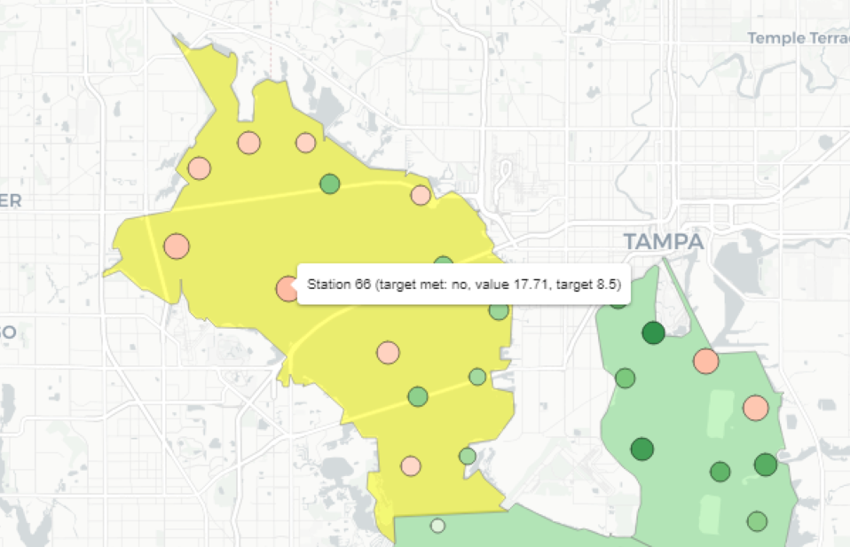
```
<br>

The legends on the bottom-right of the map show the range of values for either chlorophyll (ug/L) or light attenuation (m-1) for stations where targets or thresholds were met or not met.  The color ramps can overlap because each segment has different targets or thresholds. Results for different years, for chlorophyll or light attenuation, and references relative to targets or thresholds can be chosen from the drop-down menus. 

### DECISION MATRIX

```{r}
attmat
```

### CHLOROPHYLL RESULTS

```{r}
chlmat
```

### LIGHT ATTENUATION RESULTS

```{r}
lamat
```

Column {data-width=500}
-----------------------------------------------------------------------

### SITE ATTAINMENT BY YEAR

```{r ecphc_validate, context = 'server'}
output$attmap <- renderLeaflet({attmap()})
fillCol(flex = c(NA, 1),
  column(12,
    column(6,
      sliderInput('yrsel', 'Select year:', min = 1975, max = maxyr, value = maxyr, step = 1, sep = '', width = '200%', animate = T),
    ),
    column(3, 
      selectInput('thrsel', 'Select indicator:', choices = list('Chlorophyll-a (ug /l)' = 'chla', 'Light attenuation (m-1)' = 'la'))
    ), 
    column(3, 
      selectInput('mapref', 'Select map reference:', choices = list('Management target' = 'target', 'Threshold (+2 se)' = 'threshold'))   
    )
  ),
  leafletOutput('attmap')
)
```

2 SEGMENT ANNUAL TRENDS {data-navmenu="PAGE SELECTION"}
===========================================================

Column {data-width=275}
-----------------------------------------------------------------------

### Using this page

This page shows time series of annual chlorophyll and light attenuation averages for each bay segment.  Blue lines on each plot show management targets or thresholds that define exceedance categories used to create the management action categories (i.e., <span style="color:#33FF3B; text-shadow: 0 0 3px #333;">__Stay the Course__</span>, <span style="color:#F9FF33; text-shadow: 0 0 3px #333;">__Caution__</span>, or <span style="color:#FF3333; text-shadow: 0 0 3px #333;">__On Alert__</span>).

In between the chlorophyll (top) and light attenuation (bottom) plots are the attainment matrix outcomes that are specific to each segment.  The top row in the matrix shows the attainment outcome for chlorophyll, the bottom row shows the attainment outcome for light attenuation, and the middle row shows the overall management attainment outcome that combines information from both the chlorophyll and light attenuation outcomes.  These are the same matrix outcomes as in the __ATTAINMENT MATRICES__ page, but specific to the selected bay segment.  

Understanding the results in the plots can provide context for the overall management outcome shown in the middle row of the center plot.  The management outcome is based on patterns of both chlorophyll and light attenuation, magnitude of the annual averages, and a temporal component that measures how long exceedances were observed.  These outcomes that are assigned to chlorophyll and light attenuation are assigned as follows: 

<br>
```{r out.width='80%', fig.align='center'}

```
<br>

For each year, the average chlorophyll and light attenuation values are assigned an integer value from 0 to 3, with higher values indicating less favorable water quality conditions for seagrass growth.  Hovering over the center matrix will show the information that was used from the time series plots to determine the management outcome for a given year.  For example, Old Tampa Bay in 1980 received a management outcome of <span style="color:#FF3333; text-shadow: 0 0 3px #333;">__On Alert__</span>:

<br>
```{r out.width='70%', fig.align='center'}
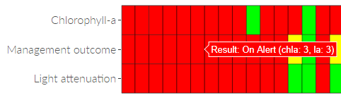
```
<br>

Both chlorophyll and light attenuation values also received an outcome of "3" for this year. Hovering over the respective cells shows this information: 

<br>
```{r out.width='90%', fig.align='center'}
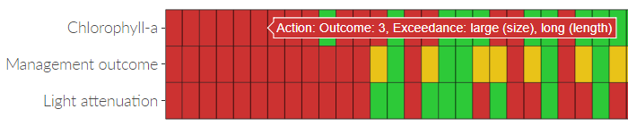
```
<br>

<br>
```{r out.width='90%', fig.align='center'}
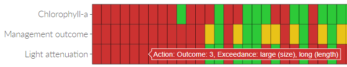
```
<br>

In both cases, the average values for 1980 for chlorophyll and light attenuation had a large magnitude exceedance of long duration, placing the year in the "3" category. The exceedance values are defined by the blue lines in the time series plots above and below the center matrix. The duration values are defined by how many times the average values were above the management target within the previous four years.  A "long" duration means that average values in the previous four years were all above the management target, i.e., the water quality conditions have persisted for some time. 

The plots are especially useful to identify which water quality conditions are driving the overall management outcome. Zooming in on 2015 to 2019 for Old Tampa Bay shows that the consistent <span style="color:#F9FF33; text-shadow: 0 0 3px #333;">__Caution__</span> categories are driven by non-sequential years of large magnitude and long duration exceedances for chlorophyll.  Light attenuation values have remained below the target.    

<br>
```{r out.width='100%', fig.align='center'}
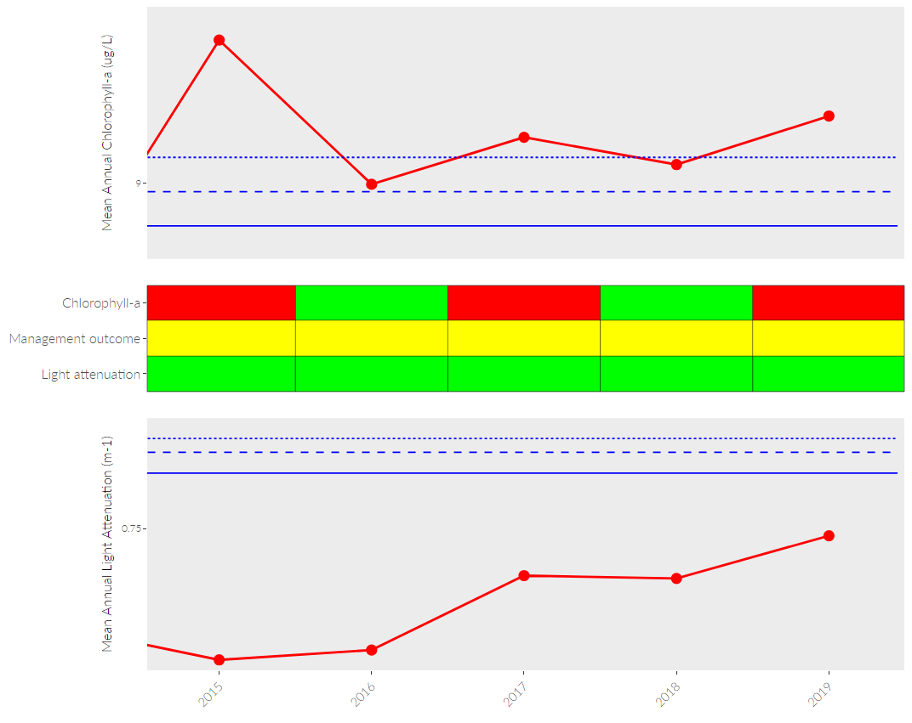
```
<br>

Column {.tabset .tabset-fade data-width=650}
-----------------------------------------------------------------------

### OLD TAMPA BAY

```{r plot_otb, fig.height = 8, fig.width = 10}
thrplototb
```

### HILLSBOROUGH BAY 

```{r plot_hb, fig.height = 8, fig.width = 10}
thrplothb
```

### MIDDLE TAMPA BAY

```{r plot_mtb, fig.height = 8, fig.width = 10}
thrplotmtb
```

### LOWER TAMPA BAY

```{r plot_ltb, fig.height = 8, fig.width = 10}
thrplotltb
```

3 SEGMENT SEASONAL TRENDS {data-navmenu="PAGE SELECTION"}
===========================================================

Column {data-width=275}
-----------------------------------------------------------------------

### Using this page

This page shows the seasonal distributions by bay segment for chlorophyll and light attenuation. The top plot shows chlorophyll distributions by month and the bottom plot shows light attenuation values by month.  Each boxplot shows the distribution of observations across all available years for the appropriate month:

<br>
```{r, fig.align='center', out.width='80%'}
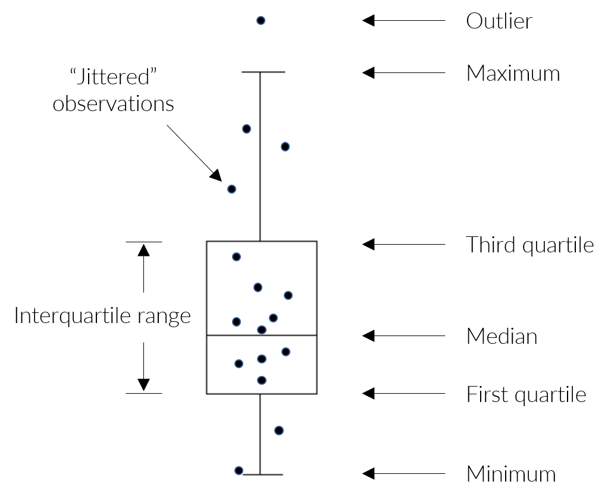
```
<br>

Conceptually, boxplots show different values along the distribution range for a collection of observations (e.g., all January chlorophyll observations in Old Tampa Bay across all years).  The horizontal line is the median and the box is bounded by the first and third quartiles (i.e., the 25th and 75th percentiles defining the interquartile range) for the data.  The whiskers extend beyond the boxes to describe the minimum and maximum values in the data, defined as 1.5 x the interquartile range.  Outliers are present above or below the whiskers.

The jittered points overlaid on the boxplots show the individual monthly values for a specific year (i.e., the values that define the dimensions of the boxplot) and the large red point shows the current year.  Hovering the mouse pointer over a point shows the year, month, and chlorophyll/light attenuation value for the point. The below example shows the popup text displayed for Old Tampa Bay after hovering over a point in the light attenuation plot on the bottom. The outlier value in July was observed in 1979.   

<br>
```{r, fig.align='center', out.width='40%'}
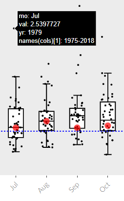
```
<br>

Each observation can also be clicked to view the observed phytoplankton cell counts for the selected year/month combination. Once a point is clicked, a stacked barplot of count values is shown on the right if phytoplankton data are available for the selected year, month, and bay segment combination. If data are unavailable, text indicating "No phytoplankton data" will be displayed where the plot should be.  The count data represent sums across segment stations for different phytoplankton taxa.

Viewing phytoplankton cell count data can be useful to determine if any bloom events may have contributed to conditions that differ from the typical seasonal ranges for a given month.  The example below shows counts for July 2019 in Old Tampa Bay.  High chlorophyll concentrations were observed in July, which can be explained by blooms of *Pyrodinium bahamense*.  The following cell count graph is returned by clicking on the point for July 2019 in the plots for Old Tampa Bay. 

<br>
```{r, fig.align='center', out.width='40%'}
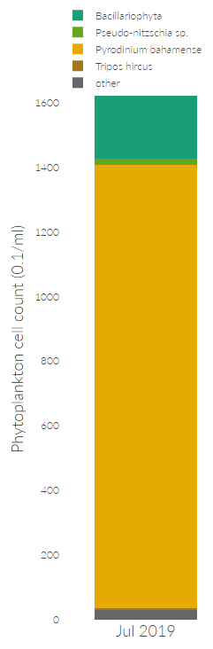
```
<br>

Column {.tabset .tabset-fade data-width=650}
-----------------------------------------------------------------------
<br>
```{r}
mainPanel(
  column(6,
    sliderInput('yrsselseas', 'Select year range:', min = 1975, max = maxyr, value = c(1975, maxyr), step = 1, sep = '', width = '400%')
  ),
  column(6,
    selectInput('yrselseas', 'Select focal year:', selected = maxyr, choices = seq(1975, maxyr))
  )
)
```

### OLD TAMPA BAY

```{r boxplot_otb, fig.height = 8, fig.width = 10, context = 'server'}
output$boxplototb <- renderPlotly({
  out <- boxplototb()
  out$x$source <- 'otbclk'
  out
})
output$otbalg <- renderPlotly(otbalg())

fillRow(flex = c(1, 0.25),
  plotlyOutput('boxplototb'),
  plotlyOutput('otbalg')
)
```

### HILLSBOROUGH BAY

```{r boxplot_hb, fig.height = 8, fig.width = 10, context = 'server'}
output$boxplothb <- renderPlotly({
  out <- boxplothb()
  out$x$source <- 'hbclk'
  out
})
output$hbalg <- renderPlotly(hbalg())

fillRow(flex = c(1, 0.25),
  plotlyOutput('boxplothb'),
  plotlyOutput('hbalg')
)
```

### MIDDLE TAMPA BAY

```{r boxplot_mtb, fig.height = 8, fig.width = 10, context = 'server'}
output$boxplotmtb <- renderPlotly({
  out <- boxplotmtb()
  out$x$source <- 'mtbclk'
  out
})
output$mtbalg <- renderPlotly(mtbalg())

fillRow(flex = c(1, 0.25),
  plotlyOutput('boxplotmtb'),
  plotlyOutput('mtbalg')
)
```

### LOWER TAMPA BAY

```{r boxplot_ltb, fig.height = 8, fig.width = 10, context = 'server'}
output$boxplotltb <- renderPlotly({
  out <- boxplotltb()
  out$x$source <- 'ltbclk'
  out
})
output$ltbalg <- renderPlotly(ltbalg())

fillRow(flex = c(1, 0.25),
  plotlyOutput('boxplotltb'),
  plotlyOutput('ltbalg')
)
```

4 SITE TRENDS {data-navmenu="PAGE SELECTION"}
===========================================================

Column {.tabset .tabset-fade data-width=250}
-----------------------------------------------------------------------

### MAP SELECTION

```{r, context = 'server'}
output$map <- renderLeaflet(bsmap)
leafletOutput('map')
```

### Using this page

This page shows the time series for chlorophyll and light attenuation at individual stations.  Data in this page can be useful to determine which stations may be driving segment averages that are displayed on pages 1-3.  Similarly, data in this page can be used to understand spatial patterns at scales smaller than individual bay segments. Begin by selecting a station on the map.  The selected station will be outlined in brown: 

<br>
```{r, fig.align='center', out.width='40%'}
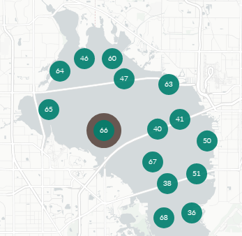
```
<br>

Plots will appear on the right after a station is selected.  The plots show phytoplankton cell counts (top), chlorophyll concentration (middle), and secchi depth (bottom, from which light attenuation is derived).  For secchi data, red points indicate when the observation was marked as ">", which usually means the secchi disk was on the bottom and water clarity exceeded the depth at the station at the time of sampling.  The three plots are linked and the x-axis can be adjusted to zoom in on a time period of interest. The subplot on the very bottom is a reference for the relative zoom on the x-axis:

<br>
```{r, fig.align='center', out.width='80%'}
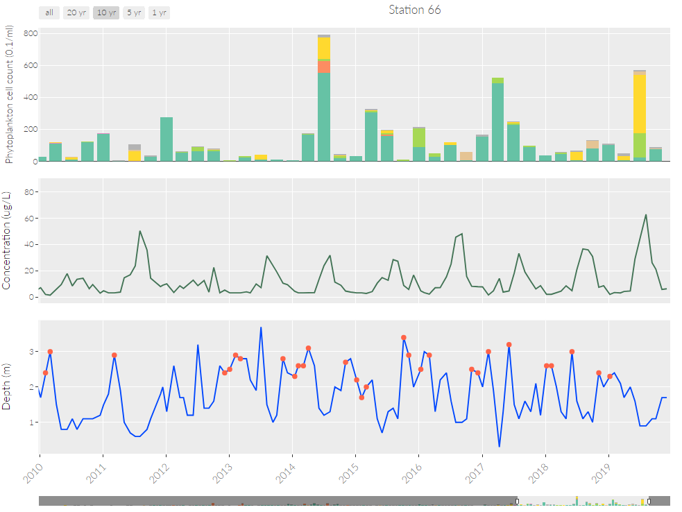
```
<br>

Ranges on the x-axis can be chosen by clicking on each plot and dragging the mouse pointer over the desired time range. Ranges can also be selected by clicking the buttons on the top that show predefined time periods.  For example, selecting the five year button will show data for only five years from the most recent date in the plot.  Note the contraction of the reference plot on the very bottom compared to the previous example:

<br>
```{r, fig.align='center', out.width='80%'}
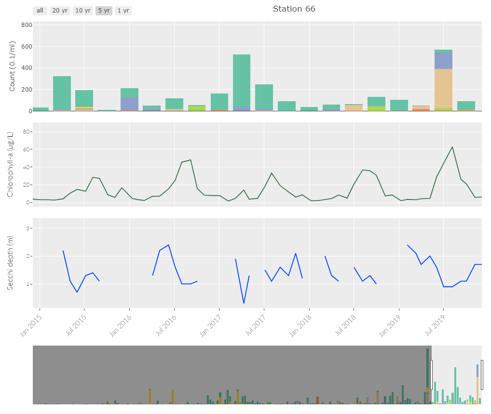
```
<br>

The phytoplankton data on the top plot show summed cell counts for the selected station in quarterly time steps (e.g., Jan/Feb/Mar 2005, Apr/May/Jun 2005, etc.).  These plots are useful to understand variation in dominant phytoplankton taxa over time at a station. The plot can also be filtered to show specific taxa by clicking on the names in the legend.  The example below shows trends in *Pyrodinium bahamense* at station 66.  Note that the legend entries for all phytoplankton taxa except *Pyrodinium bahamense* are shown in gray, indicating they have been removed from the plot by clicking each one with the mouse. 

<br>
```{r, fig.align='center', out.width='100%'}
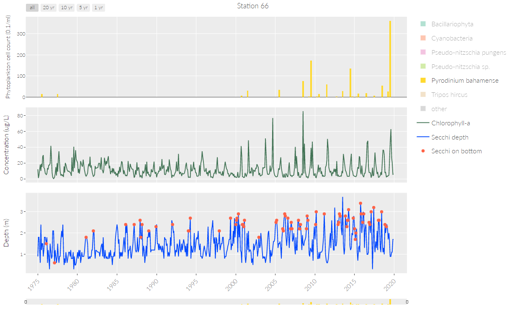
```
<br>

Column {data-width=500}
-----------------------------------------------------------------------

### PLOT

```{r, context = 'server'}
output$selplo <- renderPlotly(selplo())
plotlyOutput('selplo')
```

