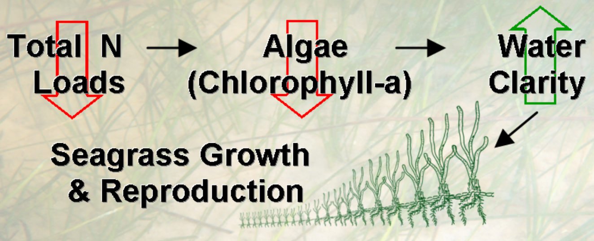

```{r setup, include=F}
knitr::opts_chunk$set(echo = F, message = F, warning = F)

# libraries
library(flexdashboard)
library(here)
library(mapview)
library(leaflet)
library(tbeptools)
# devtools::load_all('../tbeptools')
library(tidyverse)
library(patchwork)
library(shiny)
library(sf)
library(scales)
library(RColorBrewer)
library(extrafont)
library(plotly)

source(here::here('R', 'funcs.R'))

loadfonts(device = 'pdf', quiet = T)
if(Sys.info()[1] == 'Windows')
  loadfonts(device = 'win', quiet = T)

# # style file
# styles <- readLines('https://raw.githubusercontent.com/tbep-tech/css-styling/master/styles.css')
# writeLines(styles, 'styles.css')

prj <- '+proj=longlat +ellps=WGS84 +datum=WGS84 +no_defs'

load(here::here('data', 'epcdata.RData'))

maxyr <- 2019
fml <- "Lato Light"

# minor theme tweaks
pthm <- theme(
    axis.text.x = element_text(size = 11, angle = 45, hjust = 1),
    legend.text = element_text(size = 12), 
    axis.title.y = element_text(size = 12),
    text = element_text(fml), 
    legend.position = 'top',
    # panel.grid.minor=element_blank(),
    # panel.grid.major=element_blank(),
    panel.background = element_rect(fill = '#ECECEC')
    ) 

# locations
locs <- epcdata %>% 
  select(epchc_station, Longitude, Latitude) %>% 
  unique

# plotly secondary axix
ax <- list(
  tickfont = list(size=14),
  overlaying = "x",
  nticks = 4,
  side = "top"
)
seg <- c('OTB', 'HB', 'MTB', 'LTB') 
nms <- factor(seg, levels = seg)
```

```{r reactives}
# OTB threshold plot
thrplototb <- reactive({
  
  # inputs

  out <- thrplotly(epcdata, 'OTB', maxyr, fml, pthm)

  return(out)
  
})

# HB threshold plot
thrplothb <- reactive({
  
  # inputs

  out <- thrplotly(epcdata, 'HB', maxyr, fml, pthm)

  return(out)
  
})

# MTB threshold plot
thrplotmtb <- reactive({
  
  # inputs

  out <- thrplotly(epcdata, 'MTB', maxyr, fml, pthm)

  return(out)
  
})

# LTB threshold plot
thrplotltb <- reactive({
  
  # inputs
  
  out <- thrplotly(epcdata, 'LTB', maxyr, fml, pthm)

  return(out)
  
})

# OTB boxplot
boxplototb <- reactive({
  
  # inputs

  out <- boxplotly(epcdata, 'OTB', maxyr, fml, pthm)

  return(out)
  
})

# HB boxplot
boxplothb <- reactive({
  
  # inputs

  out <- boxplotly(epcdata, 'HB', maxyr, fml, pthm)

  return(out)
  
})

# MTB boxplot
boxplotmtb <- reactive({
  
  # inputs

  out <- boxplotly(epcdata, 'MTB', maxyr, fml, pthm)

  return(out)
  
})

# LTB boxplot
boxplotltb <- reactive({
  
  # inputs

  out <- boxplotly(epcdata, 'LTB', maxyr, fml, pthm)

  return(out)
  
})

# data to map based on yrsel, thrsel
mapdat <- reactive({
  
  # inputs
  yrsel <- input$yrsel
  thrsel <- input$thrsel
  
  # data to map
  toplo <- epcdata %>% 
    anlz_avedatsite %>% 
    anlz_attainsite(thr = thrsel)

  return(toplo)
  

})

# color palette for target met
palyes <- reactive({
  
  # input
  mapdat <- mapdat()
  
  dmn <- mapdat %>% 
    filter(trgtmet == 'yes') %>% 
    pull(val) %>% 
    range(na.rm = T)
  
  colorNumeric(
    palette = brewer.pal(4, 'Greens'),
    na.color = 'yellow',
    domain = dmn
    )
  
})

# color palette for target not met
palno <- reactive({
  
  # input
  mapdat <- mapdat()
  
  dmn <- mapdat %>% 
    filter(trgtmet == 'no') %>% 
    pull(val) %>% 
    range(na.rm = T)
  
  colorNumeric(
    palette = brewer.pal(4, 'Reds'),
    na.color = 'yellow',
    domain = dmn
    )
  
})
  
# site attainment map
attmap <- reactive({
  
  # inputs
  thrsel <- input$thrsel
  yrsel <- input$yrsel
  palyes <- palyes()
  palno <- palno()
  mapdat <- mapdat()
  
  # filter by year to map
  toplo <- mapdat %>% 
    filter(yr %in% yrsel) %>% 
    mutate(
      cols = case_when(
        trgtmet == 'yes' ~ palyes(val),
        trgtmet == 'no' ~ palno(val)
      )
    ) %>% 
    left_join(locs, by = 'epchc_station') %>% 
    st_as_sf(coords = c('Longitude', 'Latitude'), crs = prj)

  # values to feed to legend  
  yesval <- toplo %>% filter(trgtmet == 'yes') %>% pull(val)
  noval <- toplo %>% filter(trgtmet == 'no') %>% pull(val)
  
  # for point scaling, original range
  scls <- dplyr::case_when(
    thrsel == 'chla' ~ c(0.59, 58), 
    thrsel == 'la' ~ c(0.38, 5.92)
  )
  
  # map with custom legends
  mapview(toplo, fill = F, homebutton = F, popup = NULL, legend = F) %>% 
    .@map %>% 
    clearMarkers() %>% 
    leafem::removeMouseCoordinates() %>%
    addCircleMarkers(
      data = toplo, 
      layerId = ~epchc_station,
      stroke = TRUE,
      color = 'black',
      fill = TRUE,
      fillColor = ~cols,
      weight = 1,
      fillOpacity = 1,
      radius=~rescale(val, from = scls, to = c(4, 15)),
      label = ~paste0('Station ', epchc_station, ' (target met: ', trgtmet, ', value ', round(val, 2), ', target ', target, ')')
    ) %>% 
    addLegend("bottomright", pal = palyes, title = "Target met", labels = thrsel, opacity = 1, values = yesval) %>% 
    addLegend("bottomright", pal = palno, title = "Target not met", labels = thrsel, opacity = 1, values = noval)
  
})

# attainment matrix
attmat <- reactive({
  
  # input
  
  plo <- show_matrix(epcdata, yrrng = c(1975, maxyr), family = fml, txtsz = NULL) + 
    theme(
      axis.text = element_text(size = 12),
      text = element_text(family = fml),
      axis.text.x = element_blank(), 
      axis.ticks.x = element_blank()
    )

  out <- ggplotly(plo, tooltip = 'Action') %>%
    add_bars(x = ~nms,y = ~c(1, 1, 1, 1), xaxis = "x2", inherit = F) %>%
    layout(xaxis2 = ax)

  return(out)
  
})

# chl matrix
chlmat <- reactive({
  
  # input
  
  plo <- show_wqmatrix(epcdata, param = 'chla', yrrng = c(1975, maxyr), family = fml, txtsz = NULL) + 
    theme(
      axis.text = element_text(size = 12), 
      text = element_text(family = fml),
      axis.text.x = element_blank(), 
      axis.ticks.x = element_blank()
    ) 
  
  out <- ggplotly(plo, tooltip = 'Result') %>%
    add_bars(x = ~nms,y = ~c(1, 1, 1, 1), xaxis = "x2", inherit = F) %>%
    layout(xaxis2 = ax)
  
  return(out)
  
})

# la matrix
lamat <- reactive({
  
  # input
  
  plo <- show_wqmatrix(epcdata, param = 'la', yrrng = c(1975, maxyr), family = fml, txtsz = NULL) + 
    theme(
      axis.text = element_text(size = 12), 
      text = element_text(family = fml),
      axis.text.x = element_blank(), 
      axis.ticks.x = element_blank()
    ) 
  
  out <- ggplotly(plo, tooltip = 'Result') %>%
    add_bars(x = ~nms,y = ~c(1, 1, 1, 1), xaxis = "x2", inherit = F) %>%
    layout(xaxis2 = ax)
  
  return(out)
  
})

# selectd site plots
selplo <- reactive({
  
  validate(
    need(!is.null(selsit), "Select station on map")
  )
  # req(selsit)
  
  toplo <- epcdata %>% 
    filter(epchc_station %in% selsit) %>% 
    filter(yr >= 1975) %>% 
    select(SampleTime, sd_m, chla) 
  
  p1 <- ggplot(toplo, aes(x = SampleTime, y = chla)) + 
    geom_line(colour = "#427355") + 
    # scale_y_log10() + 
    labs(
      y = 'Chlorophyll-a (ug/L)', 
      x = NULL
      ) +
    pthm
  
  p2 <- ggplot(toplo, aes(x = SampleTime, y = sd_m)) + 
    geom_line(colour = "#0047FE") + 
    labs(
      y = 'Secchi depth (m)', 
      x = NULL, 
      title = paste0('Station ', selsit)
      ) + 
    pthm
  
  p1 <- ggplotly(p1, dynamicTicks = T)
  p2 <- ggplotly(p2, dynamicTicks = T)
  
  out <- subplot(p1, p2, nrows = 2, shareX = T, titleY = T) %>% 
    rangeslider() %>%
    layout(
      # hovermode = "x", 
      xaxis = list(domain = c(0.02,1))
      )
  
  return(out)
  
})
```

```{r map}
# site selection map
output$map <- renderLeaflet({
  
  # filter by year to map
  toplo <- locs %>% 
    st_as_sf(coords = c('Longitude', 'Latitude'), crs = prj)
  
  # map with custom legends
  mapview(toplo, fill = F, homebutton = F, popup = NULL, legend = F) %>% 
    .@map %>% 
    clearMarkers() %>%
    leafem::removeMouseCoordinates() %>%
    addCircleMarkers(
      data = locs,
      lng = ~Longitude, 
      lat = ~Latitude,
      layerId = ~epchc_station,
      color = '#00806E',
      stroke = F,
      fillOpacity = 0.9,
      radius = 10,
      label = ~epchc_station,
      labelOptions = labelOptions(
        textOnly = T,
        noHide = T,
        style = list(
          "color" = "#FFFFFF",
          "font-family" = fml
          ),
        direction = 'center'
      )
    )

})

# leaflet proxy for marker select
map <- leafletProxy('map')

# binding for marker select and year
makeReactiveBinding('selsit')

# the selection
observeEvent(input$map_marker_click, {
  selsit <<- input$map_marker_click$id
})

observeEvent(input$map_marker_click, {
  
  # station locations
  toplo <- locs %>% 
    st_as_sf(coords = c('Longitude', 'Latitude'), crs = prj)

  # filter the pour points by selection
  selsitplo <- toplo %>% 
    filter(epchc_station %in% selsit)

  # clear markers on input select, add all points and selected point
  map <- map %>% 
    clearMarkers() %>% 
    leafem::removeMouseCoordinates() %>%
    addCircleMarkers(
      data = selsitplo,
      layerId = ~epchc_station,
      stroke = F,
      color = '#5C4A42',
      fill = T,
      radius = 20,
      fillOpacity = 0.9
    ) %>%
    addCircleMarkers(
      data = locs,
      lng = ~Longitude, 
      lat = ~Latitude,
      layerId = ~epchc_station,
      color = '#00806E',
      stroke = F,
      fillOpacity = 0.9,
      radius = 15,
      label = ~epchc_station,
      labelOptions = labelOptions(
        textOnly = T,
        noHide = T,
        style = list(
          "color" = "#FFFFFF",
          "font-family" = fml
          ),
        direction = 'center'
      )
    )

})
```

OVERVIEW
===========================================================

Column {data-width=650}
-----------------------------------------------------------------------

### WELCOME TO THE TAMPA BAY WATER QUALITY REPORT CARD!

#### Background

Light availability to seagrass is the guiding paradigm for TBEP’s Nitrogen Management Strategy. Because excessive nitrogen loads to the bay generally lead to increased algae blooms (higher chlorophyll-a levels) and reduce light penetration to seagrass, an evaluation method was developed to assess whether load reduction strategies are achieving desired water quality results (i.e. reduced chlorophyll-a concentrations and increased water clarity).

```{r out.width='30%', fig.align='center', fig.cap='The guiding paradigm for seagrass restoration through nitrogen management.'}

```

#### Decision support approach

Year to year algae abundance (measured as chlorophyll-a concentrations) and visible light penetration through the water column (secchi disk depth visibility) have been identified as critical water quality indicators in Tampa Bay. Tracking the attainment of bay segment specific targets for these indicators provides the framework for developing and initiating bay management actions. TBEP management actions adopted in response to the annually-assessed decision support results are shown below.

<span style="color:#33FF3B; text-shadow: 0 0 3px #333;">__Stay the Course__</span>: Continue planned projects. Report data via annual progress reports and Baywide Environmental Monitoring Report. 

<span style="color:#F9FF33; text-shadow: 0 0 3px #333;">__Caution__</span>: Review monitoring data and nitrogen loading estimates. Begin/continue TAC and Management Board development of specific management recommendations.

<span style="color:#FF3333; text-shadow: 0 0 3px #333;">__On Alert__</span>: Finalize development and implement appropriate management actions to get back on track.

The management category or action is based on the combination of outcomes for chlorophyll and light attenuation.  For each year, major bay segments are assigned to outcome categories based on both the exceedance of the annual estimate above a threshold or target and duration of the exceedance for the years prior.  Exceedances are defined as either small or large based on the magnitude and short or long based on the duration within the previous four years.  The combination of these exceedance categories creates an outcome integer that each bay segment is assigned for both chlorophyll and light attenutation. 

```{r out.width='30%', fig.align='center', fig.cap='Outcomes for annual estimates of water quality are assigned an integer value from zero to three depending on both magnitude and duration of the exceedence.'}
knitr::include_graphics('www/outints.png')
```

The chlorophyll and light attenuation outcome integers are then combined to create the management category for each bay segment.

```{r out.width='30%', fig.align='center', fig.cap='Management action categories assigned to each bay segment and year based on chlorophyll and light attenuation outcomes.'}
knitr::include_graphics('www/matrixcats.png')
```

#### Using the dashboard

The different tabs on the dashboard can be used to view the long-term trends in water quality for each bay segment and individual monitoring stations.  The "ANNUAL MEANS TIME SERIES PLOTS" tab show time series of chlorophyll and light attenuation averages for each bay segment.  Blue lines on each plot show management targets or thresholds that define exceedance categories used to create the management action categories.  The "TARGET ATTAINMENT" tab shows the overall report card for the bay as management action categories described above.  Separate matrices for chlrophyll and light attenuation exceedances for major bay segments are also shown.  An interactive map is provided that shows attainment outcomes by year for individual stations in the bay.  Note that the map shows site-specific attainments for bay segment targets as a reference only. 

#### Site information

Questions and comments about the dashboard can be directed to [Marcus Beck](mailto:mbeck@tbep.org). The page source content can be viewed on [Github](https://github.com/tbep-tech/wq-dash).

SEGMENT TIME SERIES
===========================================================

Column {.tabset .tabset-fade data-width=650}
-----------------------------------------------------------------------

### OLD TAMPA BAY

```{r plot_otb, fig.height = 8, fig.width = 10}
output$thrplototb <- renderPlotly(thrplototb())
plotlyOutput('thrplototb')
```

### HILLSBOROUGH BAY 

```{r plot_hb, fig.height = 8, fig.width = 10}
output$thrplothb <- renderPlotly(thrplothb())
plotlyOutput('thrplothb')
```

### MIDDLE TAMPA BAY

```{r plot_mtb, fig.height = 8, fig.width = 10}
output$thrplotmtb <- renderPlotly(thrplotmtb())
plotlyOutput('thrplotmtb')
```

### LOWER TAMPA BAY

```{r plot_ltb, fig.height = 8, fig.width = 10}
output$thrplotltb <- renderPlotly(thrplotltb())
plotlyOutput('thrplotltb')
```

SEGMENT SEASONAL BOXPLOTS
===========================================================

Column {.tabset .tabset-fade data-width=650}
-----------------------------------------------------------------------

### OLD TAMPA BAY

```{r boxplot_otb, fig.height = 8, fig.width = 10}
output$boxplototb <- renderPlotly(boxplototb())
plotlyOutput('boxplototb')
```

### HILLSBOROUGH BAY

```{r boxplot_hb, fig.height = 8, fig.width = 10}
output$boxplothb <- renderPlotly(boxplothb())
plotlyOutput('boxplothb')
```

### MIDDLE TAMPA BAY

```{r boxplot_mtb, fig.height = 8, fig.width = 10}
output$boxplotmtb <- renderPlotly(boxplotmtb())
plotlyOutput('boxplotmtb')
```

### LOWER TAMPA BAY

```{r boxplot_ltb, fig.height = 8, fig.width = 10}
output$boxplotltb <- renderPlotly(boxplotltb())
plotlyOutput('boxplotltb')
```

TARGET ATTAINMENTS
===========================================================

Column {.tabset .tabset-fade data-width=250}
-----------------------------------------------------------------------

### ATTAINMENT MATRIX

```{r}
output$attmat <- renderPlotly(attmat())
plotlyOutput('attmat')
```

### CHLOROPHYLL MATRIX

```{r}
output$chlmat <- renderPlotly(chlmat())
plotlyOutput('chlmat')
```

### LIGHT ATTENUATION MATRIX

```{r}
output$lamat <- renderPlotly(lamat())
plotlyOutput('lamat')
```

Column {data-width=500}
-----------------------------------------------------------------------

### SITE ATTAINMENT BY YEAR

```{r ecphc_validate}
output$attmap <- renderLeaflet({attmap()})
fillCol(flex = c(NA, 1),
  inputPanel(
    selectInput('yrsel', 'Select year:', choices = seq(1975, maxyr), selected = maxyr),
    selectInput('thrsel', 'Select indicator:', choices = list('Chlorophyll-a (ug /l)' = 'chla', 'Light attenuation (m-1)' = 'la'))
    ),
  leafletOutput('attmap')
)
```


SITE TIME SERIES
===========================================================

Column {.tabset .tabset-fade data-width=250}
-----------------------------------------------------------------------

### SELECT A SITE

```{r mapout}
leafletOutput('map')
```

Column {.tabset .tabset-fade data-width=500}
-----------------------------------------------------------------------

### PLOT

```{r}
output$selplo <- renderPlotly(selplo())
plotlyOutput('selplo')
```

